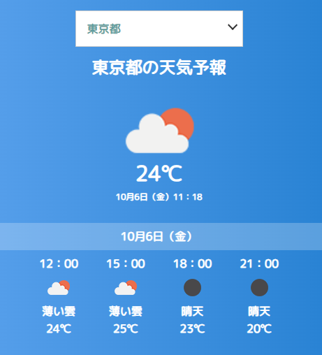
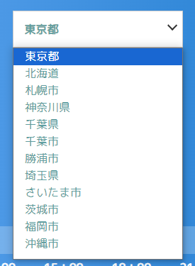
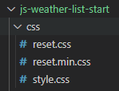

# Javascript で天気予報アプリを作成しましょう。



## スライド資料

[資料へのリンク](https://drive.google.com/file/d/1_aLoDq9y9rH8JN2weMekYWoVhH14ES6_/view?usp=sharing)
<br>

## 完成イメージ

[完成イメージへのリンク](https://tec-yoshi-taka.github.io/js-weather-list-finish/)
<br><br>

---

# コードの部分はこちらを参照してください。

---

## 地域を選択する HTML を作成しよう

### 19 行目に下記を入力してみよう

### 好きな都道府県や街を追加してみよう

```HTML
<div class="selectbox">
	<select name="住所" id="select_box">
		<option value="tokyo" selected>東京都</option>
		<option value="hokkaido">北海道</option>
	</select>
</div>

```

#### 都市名一覧


<br>

---

## 文字の色やサイズを変えてみよう

### CSS フォルダ → style.css



### style.css の 13 行目

### font-size: 24px;の数字を変更しよう

### color: yellow;を追加して、好きな色に変更しよう

```CSS
h1 {
  font-size: 24px;
  text-align: center;
  font-weight: bold;
  color: yellow;
}
```

## CSS でグラデーション

[CSS Gradient へのリンク](https://cssgradient.io/)
